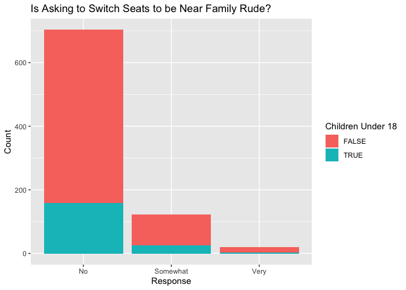

Do Airplanes Have a Social Code?
================

## Overview

This is a first attempt at using R studio along with Github. I created a
plot based on the fivethirtyeight R package.

## Loading Pakcages

``` r
library(ggplot2)
library(tidyverse)
```

    ## ── Attaching packages ─────────────────────────────────────── tidyverse 1.3.1 ──

    ## ✓ tibble  3.1.4     ✓ dplyr   1.0.7
    ## ✓ tidyr   1.1.3     ✓ stringr 1.4.0
    ## ✓ readr   2.0.1     ✓ forcats 0.5.1
    ## ✓ purrr   0.3.4

    ## ── Conflicts ────────────────────────────────────────── tidyverse_conflicts() ──
    ## x dplyr::filter() masks stats::filter()
    ## x dplyr::lag()    masks stats::lag()

``` r
library(fivethirtyeight)
```

## Statistics

This is an investigation of what constitutes an airline “faux pas”.
Specifically Is it considered rude to request to change seats in order
to sit near a family member? If someone has children of their own, does
that effect their opinion? This visualizaiton was created using the
fivethirtyeight R package.

<!-- -->

This graph demonstrates that having children does not make someone more
inclined to view a requested seat change as acceptabel behavior.
